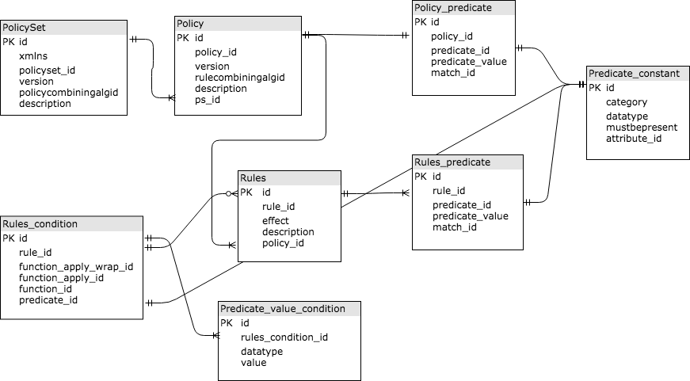

<html><head>

ACL GENERATOR
<head><html>

Requirements :

        1.  Spring Boot
        2.  Node.js
        3.  Docker-machine (optional)
        
Usage: 

    Without Docker:
        1. Start the Springboot server - run the compiled jar using the cmd "java -jar ./target/policy-0.0.1-SNAPSHOT.jar"
        
        2. Start the React server - "cd web" followed by "npm start"

        3. Access the site at localhost:3000

    With Docker:
        I have written a docker-compose.yml to automatically start up these two as containers.

        1. Build the two images in your local docker-machine - "docker-compose build"

        2. Deploy the two containers - "docker-compose up"

        3. Access the site at localhost:80

H2 database:

    1.  Go to localhost:8080/h2-console or for some users, enter 'your-ip':8080/h2-console
            - you should see a h2-console login page
            - change JDBC Url to 'jdbc:h2:file:./acldb'  <-- this is to access the generated db instance from your file system.
            - you should be able to see the tables and data

    2.  Since H2 is an in-memory database, do note that anything saved inside the DB will be gone once you restart the server.
        To persist you data, add your policy into data.sql and recompile the app - "mvn package"
        This will ensure that your data will be bootstrapped into H2 when your server starts.

ER Diagram:

        
        
Support:
   
        Ong, Marcus Jiong Kai <Marcusjiongkai.Ong@sc.com>;

